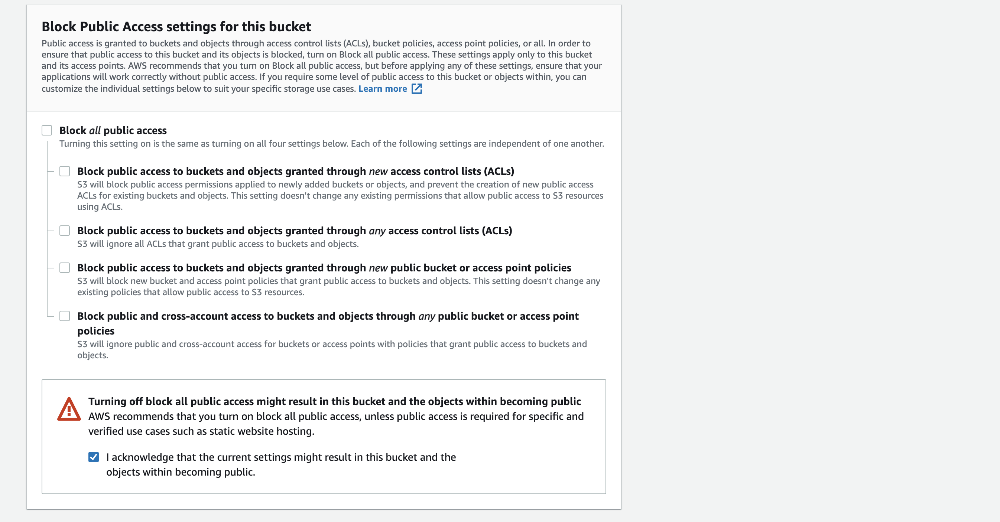
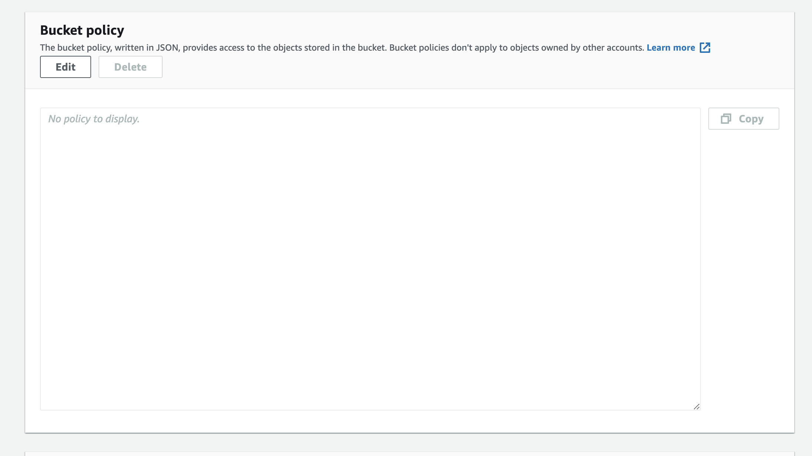

# Amazon AWS S3 Bucket Configuration

[Click here to return to README.md](README.md)

This project uses the cloud-based storage service [Amazon S3](https://aws.amazon.com/s3/?nc2=type_a) to serve static and media files in production.

In order to create your own S3 Bucket to connect to your app, follow these steps.

## Create an Amazon AWS Account

* Navigate to [Amazon AWS](https://aws.amazon.com/).
* Click the button in the right hand corner, reading 'Sign in to the console'.
* Below the sign-in form presented, select the button 'Create a new AWS account'.
* Enter your e-mail as 'root user', and click the button reading 'Verify Email Address'
* Open your inbox and find the confirmation email sent to your from AWS.
* Verify your email address

## Creating an S3 Bucket

* Once signed in, navigate to S3 and select 'Create Bucket'

* Give your bucket a name, and select the region nearest to you.
* In this same page, select the checkbox reading 'ACLs Enabled' and acknowledge the warning S3 displays.

* Turn off 'Block all Public Access' and check the box to acknowledge displayed in the warning.

* Click 'Create Bucket'

## Configuring your S3 Bucket

### Set Static Website Hosting

* Navigate to your newly created S3 bucket
* Select the tab reading "Properties"

* Scroll to the bottom of the permissions page, and select the 'Edit' button which sits within the 'Static Website Hosting' card.

* Enable Static Website Hosting, and provide a name for your index document (*index.html*)
* If you like, enter a default value for your error page also (*error.html*)
* Click **Save**

### Configure Permissions

* Go back to your bucket's dashboard and scroll to the top of the page.
* Select the "Permissions" tab.

#### CORS Bucket Policy Configuration

* Scroll to the bottom of your "Permissions" Page, until you reach a window with the title "Edit cross-origin resource sharing (CORS)"
* Click the button reading "Edit".

* Enter the JSON config displayed in the above image, and click '**Save Changes**'.

* Go back to the permissions page, and scroll up until you find a window with the header "Bucket Policy"
* Click "**Edit**"

* Upon reaching this window, copy the Bucket ARN, as you will need it in the next step.
* Click "**Policy Generator**"

* When you're in the Policy Generator:
    * Select 'S3 Bucket' for your Type of Policy.
    * Type "*" in the text input labelled 'Principal'.
    * Under 'Actions' select 'Get Object'.

* Then, click "**Add Statement**"
* Then, click "**Generate Policy**"

* Copy your bucket policy.

* Paste your bucket policy in the 'Edit Bucket Policy' window.
    * Make sure to add another ARN in 'Resources', and append `/*` to the end, to allow access to all object within your policy.
* Click "**Save Changes**"

* When you're back on the main bucket's page. Scroll to fint the *Access Control List*
* Select Edit

* Check the checkbox with label "List" where it says "Everyone (public access)".
* Acknowledge the warning S3 displays.
* Click "**Save Changes**"

## Create an IAM (Identity and Access Management) User

* Navigate to Amazon AWS 'IAM' Platform
* In the left-hand sidebar, select "User Groups"

* Click "Create Group"
* Choose a name for your group (my-awesome-group)
* Scroll to the bottom, and click "**Create Group**"

* Navigate to your group
* Select "Permissions" tab
* Open the dropdown to the right, and select "**Attach Policy**"

* Upon landing on the next page, select "**Import Managed Policy**"
* Search for "AmazonS3FullAccess" and select the checkbox
* Click "**Import**"

* Next, grab your ARN number from your bucket policy.
* Paste it under "Resources"
* Scroll to the bottom and click "**Review Policy**"

* In the next section, give your policy a name and a description.
* Click "**Create Policy**".

* You should be taken back to your User Group's landing page.
* Under "Permissions", select the option to "**Attach Policy**"

* Select your new policy by checking the checkbox next to it's name and description.
* Scroll to the bottom, and click "**Add Permissions**".
* This policy is now attached to your user group.

## Create a User for your group

* Navigate to the "Users" tab from the sidebar
* Click "Add Users"

* Give your user a name.
* Give your user "Programattic Access" by checking the checkbox.
* Click "**Permissions**"

* Attach your new user to your group.
* Scroll to the bottom and click through to the end to create user.

* Download your .csv file containing your AMAZON_ACCESS_KEY_ID and AMAZON_SECRET_ACCESS_KEY
    * Make sure you download this, as it will not be able to be accessed once you close this page.

