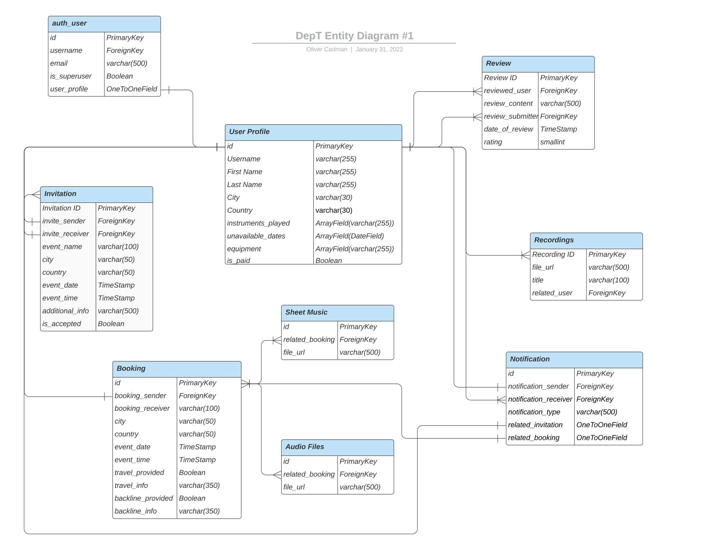
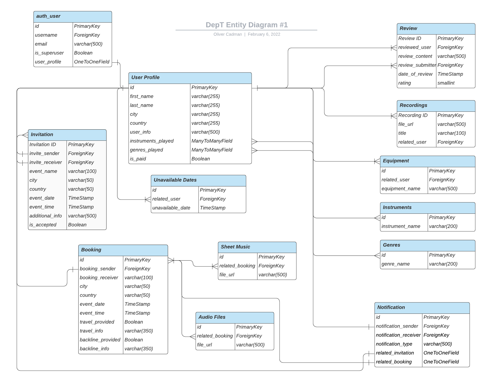
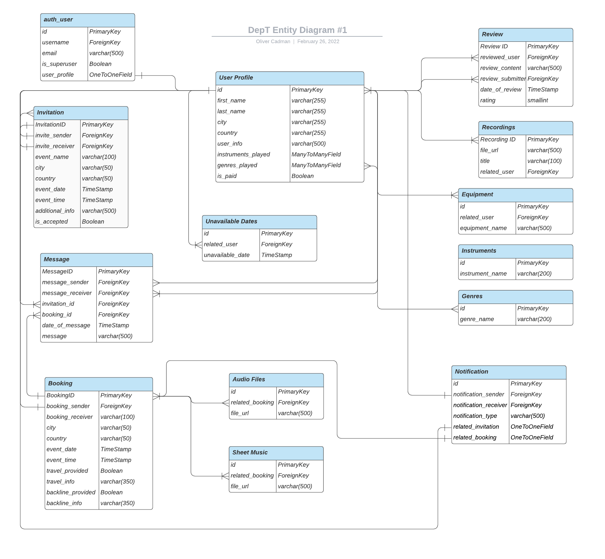
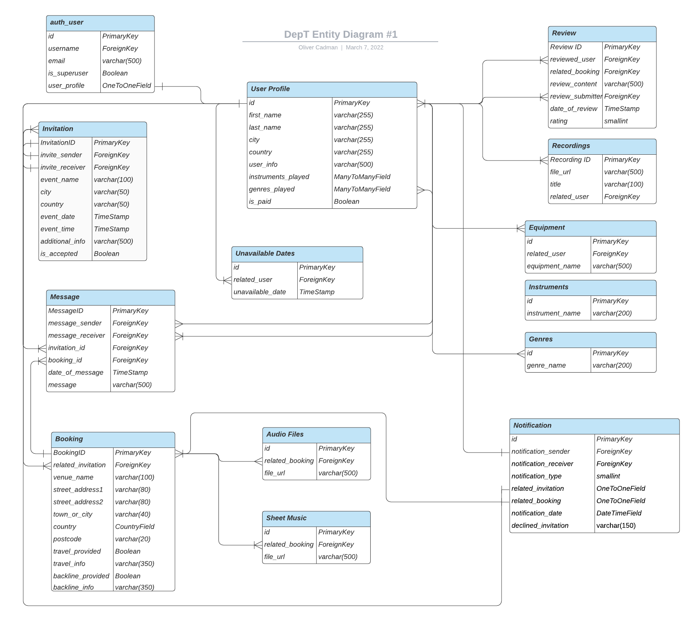

# DepT - A platform created by artists, for artists.

Dept is a full-stack, community-led, subscription-based platform allowing musicians and artists to advertise their skills and services
to band leaders, producers, other artists, or any client that requires a last-minute musician to provide a service.

If a musician booked for a gig has an unforeseen circumstance that means they have to cancel their arrangement, DepT
serves to alleviate the stress of scouring through their contacts to find a last-minute replacement, by providing the opportunity
to quickly and easily 'dep out' gigs to the musicians using the DepT network.

Through DepT, artists can discover one another, increase revenue through their art, and build communities. 

By building communities, artists will acquire a diverse workspace and connect with a wider network.

# Overview

DepT comes from the word “to dep”, which is a term that is commonly used within the music industry to describe a musician who takes the place of a
regular band member temporarily - usually when a band member has fallen ill, has a personal issue, or more commonly has been offered a better-paid gig (such as a tour). 

The idea for the platform is born out of the personal struggle of finding last-minute “deps” outside of my immediate network.
Also, due to Covid-19, connecting with other artists and finding work has been difficult.

# UX

## Strategy

### Stakeholder Interviews

What problems/pain points do you experience when searching for a dep?

* *"My immediate network is limited by the number of musicians in my contact list"*

* *"My immediate network is limited to the locality of the area in which I live and work."*

* *"It takes a lot of time and effort to source a suitable dep, especially when the situation is time-sensitive"*

* *"A dep's availability (or lack thereof) can only be determined through a phone call or text, which is not time-effective."*

* *"A limited network of deps in the local area can result in travelling a long distance to a gig, which increases environmental impact."*

* *"There's a lack of opportunity to make myself more discoverable among a wider network of musicians."*

## Ideal Users

* Musicians/artists operating in the music industry who need to 'dep' out a gig.
* Musicians/artists operating in the music industry who are looking for job opportunities.
* Bookers/band-leaders/producers who are in need of a last-minute musician/artist to provide their services.

## Project Goal

To provide a sleek, efficient and trustworthy booking service, enabling musicians to dep out their gigs and for clients to find dep musicians, all with minimum stress.

### User Stories

#### First-Time Visitors

As a visitor using the website for the first time, I want...

1. The purpose of the website to be evident upon the first visit, so I can quickly determine that the website will suit my needs.
2. To be able to navigate the website intuitively and with ease on all devices, so that my time isn't wasted.
3. To easily find information about how to use the platform, so I can understand the model of the service provided.

#### Potential Members

As a potential member, I want...

1. Testimonies to be displayed and easily found, so I can determine the quality and effectiveness of the service.
2. To easily find out what benefits I get from being a paying member, so I can determine whether the service is worth my money.
3. To be able to register to the website, so I can manage and display a profile.

#### Deps For Hire

##### Tier One Membership (Free)

As a Tier One member of the website, I want...

1. To be able to upload samples of my music to my profile, so I can showcase my skills and expertise.
2. A link to my profile to be listed on a page, so potential clients/musicians will be able to find me easily.
3. To be able to find other members using the service, so I am able to find a dep easily in the case that I can't make a gig.
3. To be notified when I get a job offer from a another member, so I can respond quickly and professionally.
4. To be able to message a member with a response without leaving the website, to make the process run as smoothly as possible.
5. To be able to message other members of the website, so I can grow my network.
6. To display reviews/ratings from members for who I have provided services, so I can improve my reputation in the community.
7. To access a dashboard displaying a record of ratings and reviews, so I can take account of how much I am benefitting from the service.

##### Tier Two Membership (Paid)

As a Tier Two member of the website, I want...

1. All privileges provided by Tier One Membership.
2. To have access to a job listing, so I can find jobs that are in my area.
3. To be able to filter jobs by location or fee range, so I can more granularly search for a suitable job.
4. To be listed at the top of searches when a potential client/musician is searching for a dep, so I can have a better chance of getting the work.

#### Members in need of a Dep

As a member who is looking for a dep musician, I want...

1. A page where I can search for dep musicians, so I can easily begin to find a dep.
2. To be able to filter musicians by their expertise, instrument or style of music they play, and location, so I can find a dep which suits my needs.
3. To be able to visit a dep's profile page, so I can find out more information about their experience and expertise.
4. To be able to find the locations of the respective deps, so I can find a dep in my local area.
5. To view a calendar of available/unavailable dates, so I can find out if a dep is available before pursuing further.
6. To hear samples of a dep's music, so I can be confident that they will provide a good service.
7. To be able to message a potential dep from within the website, so that no unnecessary time is wasted.
8. To be notified when I have received a response from a dep I have messaged, so I can confirm the arrangement quickly and smoothly.
9. To be able to send a confirmed dep a document with job details (with location, timings, number of sets etc), to allow for effective communication.

### Strategy Summary

Taking the project goal and the user stories into account, below is bulletted summary of the user needs and project objectives, required to achieve an MVP.

#### User Needs

* To be able to navigate the site intuitively and with ease.
* To be able to register, log in, and log out.
* To be able to subscribe to a Tier 1 or Tier 2 subscription.
* To be able to upgrade from a Tier 1 to a Tier 2 subscription.
* To be able to find other musicians to dep a gig to.
* To be able to display a calendar of days where I am available/unavailable.
* To be able to find listed jobs.
* To hear samples of a potential dep's music.
* To be able to message a potential dep with a job offer.
* To be able to receive a message from a contacted dep, to receive confirmation or refusal of a request.
* To be able to send details of a job to a confirmed dep.
* To be notified whenever I receive a message from another user of the website.

#### Project Objectives

* To allow all users of the website to navigate the website with minimum cognitive overload.
* To allow musicians to dep out their gigs with ease.
* To offer clients a stress-free way to find a dep musician to provide their services.
* To provide an end-to-end searching, messaging and booking service for all users.
* To paywall features between Tier 1/Tier 2 users.
* To provide incentives for Tier 1 users to upgrade to Tier 2.

## Scope

### Features

#### User Interface

* Users must be able to navigate and use the website with minimum cognitive overload.
* Users must be provided a clear path through the searching, messaging and booking process, with sufficient indicators and feedback.
* Users should be provided notifications to users when they have been contacted.
* Ensure the design of the website is responsive on all device sizes.

#### Authorization/User Management

* Users must be allowed to register, confirm their email address, login and logout to the website.
* Users must be able to reset their password, should they need to.

#### Dep Profiles

* Allow users to create, visit and edit a profile.
* Allow users to upload samples of their music to their profile.
* Implement a music player to allow for playback of their music.
* Provide a calendar for users to input and show their availability. 
* Display star rating and reviews.
* Allow users to delete profile.

#### Dashboard

* Users can visit their own dashboard page.
* Users should be able to view metric data including completed jobs, repeat business, and number of different clients.
* Users should be able to see how many invites and active engagements they have received from clients.

#### Tier One/Tier Two Content

* Messaging between users of the website.
* Notifications to users who have been contacted.
* A page listing the musicians using the service.
* Search/filter functionality to filter for a musician specializing in a specific genre/style.

#### Tier Two Content

* Create a paywall between Tier One and Tier Two content.
* Place links to Tier Two profiles at the top of the list of musicians on the relevant page.
* Create a page displaying a list of jobs offered by clients, offered only to Tier Two users.
* Allow users to upgrade from a Tier One to a Tier Two account.

#### Booking

* Provide a page with a form to allow for users to message a potential dep with a job offer.
* Provide a page with a form to allow for users to message a confirmed dep with job details.

#### Messaging

* Messaging functionality between deps and clients.
* Ability to message clients/deps from profiles, artist-list page and notifications.

#### Notifications

* Display a clickable icon in the navbar, along with account of a user's unread notifications.
* A dropdown list of all notifications a user has received.
* When a notification has been read, update the database accordingly.

## Structure

### Informational Architecture

#### General Considerations

To achieve an effective, intuitive architecture that is simple to navigate, there are two primary users that need to be taken into consideration:

* Members looking for work
* Members looking for a dep

Taking this into account, it is important to provide two clear paths through the website. One which suits the dep who is signing up to the service, 
and another which suits the member who is searching for a dep.

The common denominator between these two types of user is the need to view notifications and messages easily. Since the model of the website is centered around
communication (clients contacting deps and vice versa), it is of primary importance that both users are always able to keep track of when they have been contacted.
In an attempt to provide intuitive navigation in this regard, both users must have the ability to view notifications and messages from a Navigation Bar, 
which persists across all pages of the website. Furthermore, the website must provide sufficient navigational aids in the NavBar, and an abundance of 'call-to-action' buttons
which provide a clear path through the website, relative to the type of user.

#### Navbar

The navigation bar will persist across all pages of the website, allowing the user to navigate to any page with ease. 

#### Home Page

The home page is the landing page of the website. At the top level, a lead paragraph will brief the user of the clear purpose of the website.
Three call-to-action buttons will be featured:

* Sign In - Takes the user to through the website's authentication process.
* Find a Dep - Takes the user to the dep list page.
* Post a Job - Takes the user to a page to post a specific job.

The section below will display a list of links directed towards a user who is looking for a dep. These links will be categorized based
on the instrument/service that's required (Pianist, Violinist, Cellist, Drummer etc).

Another section will be present, featuring a more detailed overview of the website and testimonials.

#### Account Management

Users will be allowed to register, create an account, login, logout and reset their password.

#### Sign Up/Subscription

Following the user registering, the website's sign up process will proceed with presenting the user with two membership options:

* Tier One (Free)
* Tier Two (Paid)

Each option will detail the price, the services that the subscription offers, along with an incentive for the user to select a Tier Two membership.

Selecting Tier One will take the user directly to a page to add more details to their profile.

Selecting Tier Two will take the user through a Stripe payment procedure. 

#### Profile

At the top level, an image of the member will be presented, along with the instruments that they play, their location,
 and a call-to-action to book this member.

If the profile belongs to the user visiting, a call-to-action to edit their profile will be presented clearly.

Below, a music player will be displayed, along with a calendar of their available and unavailable dates.

Additionally, a detailed overview/pitch will be displayed (if provided by the user), along with work experience, and links to videos/recordings that they have
contributed to in the past.

On laptop/desktop devices, a sidebar will also be present with a list of reviews and star ratings (if any). This will collapse to full-width column on mobile.

#### Dashboard

The member's dashboard will present an overview of a history of any interactions/bookings through DepT.

At the top level, the user's membership status will be displayed. If they are on Tier One, an invite will be offered to the user to upgrade to Tier Two.

A list of all engagements will be present, filterable by 'past', 'invited' and 'active' engagements.
Each item in the list of engagements will be clickable, taking the user to the booking confirmation with details about the booking.

Additionally, details on profile 'completeness' will be displayed through a graphical progress bar, along with metric data of the user's number of jobs, repeat business and past clients they have worked with.

#### Find a Dep

The list of deps will be categorized by instrument/expertise, each represented by a link. For instance, a user can click a button for 'Keyboard Players', and be taken to a page listing keyboard players.
The top level will feature most common categories of instruments, such as Guitar, Drums, Bass, Keyboards or Vocals. A list of all remaining instruments will be listed below.

The dep list itself will be filterable by location, rating and availability. Each dep will be displayed on a card, along with rating, and a link to their profile.

Premium users will be given preferential treatment in the listing, being listed at the top of searches.

#### Invite Form

If a member is interested in hiring a particular dep, they can send an invite through a form. The form includes the type of engagement (such as function, festival, or studio work), the fee, the location, and setlist (if required).

#### Invite Page

If a member has been invited to a booking, they are presented with the details of the engagement, along with two buttons to either accept or deny the invite.

Additionally, the invitee and inviter will be able to message each other through this page, should there be further information required from the invited dep before booking.

#### Booking Form

If a dep has accepted an invite, the member offering the gig can use a form to provide all details pertaining to the engagement, including a file input which will handle PDFs for sheet music.

#### Booking Confirmation

Once a dep has received a confirmed booking, they will be sent an email with the full details of the engagement. This will be downloadable to a PDF format.
An email will also be sent to both parties involved in the booking.

#### Post a Job

Users wanting to post a job to the Job Page can do so through a form.

The form will prompt the user to enter the type of engagement (such as function, festival, or studio work), 
the fee, location, instrument required, and setlist (if applicable).

#### Job List Page

Premium deps will be able to view a bulletin board of jobs posted by other members. Jobs will be presented on individual cards, which open modal windows displaying information about the job.
Deps can register their interest in a particular job by messaging the member who posted the job, from the modal window. 

The member who posted the job will then receive notification of a dep's interest. The notification will prompt to either accept or decline the request, or visit the dep's profile.

## Database Structure

The project makes use of the SQlite Relational Database to handle data served throughout the website during development, and will be migrated to postgresql upon deployment.

### Schema 

#### Iteration 1

#### Iteration 2

#### Iteration 3

#### Iteration 4

## Skeleton

### Wireframes

* [Home Page](documentation/wireframes/dept_homepage.pdf)
* [Register](documentation/wireframes/dept_register.pdf)
* [Subscribe](documentation/wireframes/dept_subscribe.pdf)
* [Sign In](documentation/wireframes/dept_sign_in.pdf)
* [Edit Profile (Page 1)](documentation/wireframes/dept_edit_profile_1.pdf)
* [Edit Profile (Page 2)](documentation/wireframes/dept_edit_profile_2.pdf)
* [Profile](documentation/wireframes/dept_profile.pdf)
* [Find a Dep (Instrument List)](documentation/wireframes/dept_find_a_dep.pdf)
* [Find a Dep (Dep List)](documentation/wireframes/dept_dep_list.pdf)
* [Job List Page](documentation/wireframes/dept_find_a_job.pdf)
* [Dashboard](documentation/wireframes/dept_dashboard.pdf)
* [Enquiries](documentation/wireframes/dept_enquiries.pdf)
* [Booking Form](documentation/wireframes/dept_booking_form.pdf)
* [Booking Confirmation](documentation/wireframes/dept_booking_confirmation.pdf)
* [Messages](documentation/wireframes/dept_messages.pdf)

