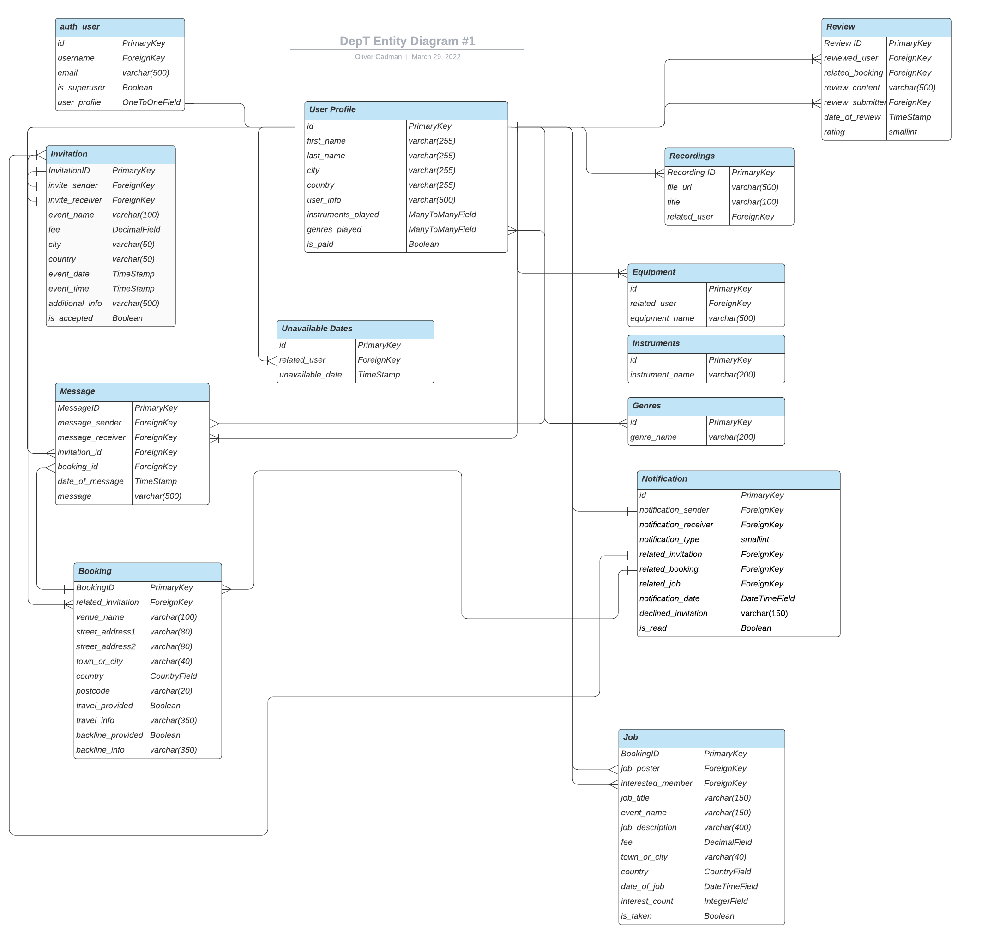

# DepT - A platform created by artists, for artists.

Dept is a full-stack, community-led, subscription-based platform allowing musicians and artists to advertise their skills and services
to band leaders, producers, other artists, or any client that requires a last-minute musician to provide a service.

If a musician booked for a gig has an unforeseen circumstance that means they have to cancel their arrangement, DepT
serves to alleviate the stress of scouring through their contacts to find a last-minute replacement, by providing the opportunity
to quickly and easily 'dep out' gigs to the musicians using the DepT network.

Through DepT, artists can discover one another, increase revenue through their art, and build communities. 

By building communities, artists will acquire a diverse workspace and connect with a wider network.

# Overview

DepT comes from the word “to dep”, which is a term that is commonly used within the music industry to describe a musician who takes the place of a
regular band member temporarily - usually when a band member has fallen ill, has a personal issue, or more commonly has been offered a better-paid gig (such as a tour). 

The idea for the platform is born out of the personal struggle of finding last-minute “deps” outside of my immediate network.
Also, due to Covid-19, connecting with other artists and finding work has been difficult.

# UX

## Strategy

### Stakeholder Interviews

What problems/pain points do you experience when searching for a dep?

* *"My immediate network is limited by the number of musicians in my contact list"*

* *"My immediate network is limited to the locality of the area in which I live and work."*

* *"It takes a lot of time and effort to source a suitable dep, especially when the situation is time-sensitive"*

* *"A dep's availability (or lack thereof) can only be determined through a phone call or text, which is not time-effective."*

* *"A limited network of deps in the local area can result in travelling a long distance to a gig, which increases environmental impact."*

* *"There's a lack of opportunity to make myself more discoverable among a wider network of musicians."*

## Ideal Users

* Musicians/artists operating in the music industry who need to 'dep' out a gig.
* Musicians/artists operating in the music industry who are looking for job opportunities.
* Bookers/band-leaders/producers who are in need of a last-minute musician/artist to provide their services.

## Project Goal

To provide a sleek, efficient and trustworthy booking service, enabling musicians to dep out their gigs and for clients to find dep musicians, all with minimum stress.

### User Stories

#### First-Time Visitors

As a visitor using the website for the first time, I want...

1. The purpose of the website to be evident upon the first visit, so I can quickly determine that the website will suit my needs.
2. To be able to navigate the website intuitively and with ease on all devices, so that my time isn't wasted.
3. To easily find information about how to use the platform, so I can understand the model of the service provided.

#### Potential Members

As a potential member, I want...

1. Testimonies to be displayed and easily found, so I can determine the quality and effectiveness of the service.
2. To easily find out what benefits I get from being a paying member, so I can determine whether the service is worth my money.
3. To be able to register to the website, so I can manage and display a profile.

#### Deps For Hire

##### Tier One Membership (Free)

As a Tier One member of the website, I want...

1. To be able to upload samples of my music to my profile, so I can showcase my skills and expertise.
2. A link to my profile to be listed on a page, so potential clients/musicians will be able to find me easily.
3. To be able to find other members using the service, so I am able to find a dep easily in the case that I can't make a gig.
3. To be notified when I get a job offer from a another member, so I can respond quickly and professionally.
4. To be able to message a member with a response without leaving the website, to make the process run as smoothly as possible.
5. To be able to message other members of the website, so I can grow my network.
6. To display reviews/ratings from members for who I have provided services, so I can improve my reputation in the community.
7. To access a dashboard displaying a record of ratings and reviews, so I can take account of how much I am benefitting from the service.

##### Tier Two Membership (Paid)

As a Tier Two member of the website, I want...

1. All privileges provided by Tier One Membership.
2. To have access to a job listing, so I can find jobs that are in my area.
3. To be able to filter jobs by location or fee range, so I can more granularly search for a suitable job.
4. To be listed at the top of searches when a potential client/musician is searching for a dep, so I can have a better chance of getting the work.

#### Members in need of a Dep

As a member who is looking for a dep musician, I want...

1. A page where I can search for dep musicians, so I can easily begin to find a dep.
2. To be able to filter musicians by their expertise, instrument or style of music they play, and location, so I can find a dep which suits my needs.
3. To be able to visit a dep's profile page, so I can find out more information about their experience and expertise.
4. To be able to find the locations of the respective deps, so I can find a dep in my local area.
5. To view a calendar of available/unavailable dates, so I can find out if a dep is available before pursuing further.
6. To hear samples of a dep's music, so I can be confident that they will provide a good service.
7. To be able to message a potential dep from within the website, so that no unnecessary time is wasted.
8. To be notified when I have received a response from a dep I have messaged, so I can confirm the arrangement quickly and smoothly.
9. To be able to send a confirmed dep a document with job details (with location, timings, number of sets etc), to allow for effective communication.

### Strategy Summary

Taking the project goal and the user stories into account, below is bulletted summary of the user needs and project objectives, required to achieve an MVP.

#### User Needs

* To be able to navigate the site intuitively and with ease.
* To be able to register, log in, and log out.
* To be able to subscribe to a Tier 1 or Tier 2 subscription.
* To be able to upgrade from a Tier 1 to a Tier 2 subscription.
* To be able to find other musicians to dep a gig to.
* To be able to display a calendar of days where I am available/unavailable.
* To be able to find listed jobs.
* To hear samples of a potential dep's music.
* To be able to message a potential dep with a job offer.
* To be able to receive a message from a contacted dep, to receive confirmation or refusal of a request.
* To be able to send details of a job to a confirmed dep.
* To be notified whenever I receive a message from another user of the website.

#### Project Objectives

* To allow all users of the website to navigate the website with minimum cognitive overload.
* To allow musicians to dep out their gigs with ease.
* To offer clients a stress-free way to find a dep musician to provide their services.
* To provide an end-to-end searching, messaging and booking service for all users.
* To paywall features between Tier 1/Tier 2 users.
* To provide incentives for Tier 1 users to upgrade to Tier 2.

## Scope

### Features

#### User Interface

* Users must be able to navigate and use the website with minimum cognitive overload.
* Users must be provided a clear path through the searching, messaging and booking process, with sufficient indicators and feedback.
* Users should be provided notifications to users when they have been contacted.
* Ensure the design of the website is responsive on all device sizes.

#### Authorization/User Management

* Users must be allowed to register, confirm their email address, login and logout to the website.
* Users must be able to reset their password, should they need to.

#### Dep Profiles

* Allow users to create, visit and edit a profile.
* Allow users to upload samples of their music to their profile.
* Implement a music player to allow for playback of their music.
* Provide a calendar for users to input and show their availability. 
* Display star rating and reviews.
* Allow users to delete profile.

#### Dashboard

* Users can visit their own dashboard page.
* Users should be able to view metric data including completed jobs, repeat business, and number of different clients.
* Users should be able to see how many invites and active engagements they have received from clients.

#### Tier One/Tier Two Content

* Messaging between users of the website.
* Notifications to users who have been contacted.
* A page listing the musicians using the service.
* Search/filter functionality to filter for a musician specializing in a specific genre/style.

#### Tier Two Content

* Create a paywall between Tier One and Tier Two content.
* Place links to Tier Two profiles at the top of the list of musicians on the relevant page.
* Create a page displaying a list of jobs offered by clients, offered only to Tier Two users.
* Allow users to upgrade from a Tier One to a Tier Two account.

#### Booking

* Provide a page with a form to allow for users to message a potential dep with a job offer.
* Provide a page with a form to allow for users to message a confirmed dep with job details.

#### Messaging

* Messaging functionality between deps and clients.
* Ability to message clients/deps from profiles, artist-list page and notifications.

#### Notifications

* Display a clickable icon in the navbar, along with account of a user's unread notifications.
* A dropdown list of all notifications a user has received.
* When a notification has been read, update the database accordingly.

## Structure

### Informational Architecture

#### General Considerations

To achieve an effective, intuitive architecture that is simple to navigate, there are two primary users that need to be taken into consideration:

* Members looking for work
* Members looking for a dep

Taking this into account, it is important to provide two clear paths through the website. One which suits the dep who is signing up to the service, 
and another which suits the member who is searching for a dep.

The common denominator between these two types of user is the need to view notifications and messages easily. Since the model of the website is centered around
communication (clients contacting deps and vice versa), it is of primary importance that both users are always able to keep track of when they have been contacted.
In an attempt to provide intuitive navigation in this regard, both users must have the ability to view notifications and messages from a Navigation Bar, 
which persists across all pages of the website. Furthermore, the website must provide sufficient navigational aids in the NavBar, and an abundance of 'call-to-action' buttons
which provide a clear path through the website, relative to the type of user.

#### Navbar

The navigation bar will persist across all pages of the website, allowing the user to navigate to any page with ease. 

#### Home Page

The home page is the landing page of the website. At the top level, a lead paragraph will brief the user of the clear purpose of the website.
Three call-to-action buttons will be featured:

* Sign In - Takes the user to through the website's authentication process.
* Find a Dep - Takes the user to the dep list page.
* Post a Job - Takes the user to a page to post a specific job.

The section below will display a list of links directed towards a user who is looking for a dep. These links will be categorized based
on the instrument/service that's required (Pianist, Violinist, Cellist, Drummer etc).

Another section will be present, featuring a more detailed overview of the website and testimonials.

#### Account Management

Users will be allowed to register, create an account, login, logout and reset their password.

#### Sign Up/Subscription

Following the user registering, the website's sign up process will proceed with presenting the user with two membership options:

* Tier One (Free)
* Tier Two (Paid)

Each option will detail the price, the services that the subscription offers, along with an incentive for the user to select a Tier Two membership.

Selecting Tier One will take the user directly to a page to add more details to their profile.

Selecting Tier Two will take the user through a Stripe payment procedure. 

#### Profile

At the top level, an image of the member will be presented, along with the instruments that they play, their location,
 and a call-to-action to book this member.

If the profile belongs to the user visiting, a call-to-action to edit their profile will be presented clearly.

Below, a music player will be displayed, along with a calendar of their available and unavailable dates.

Additionally, a detailed overview/pitch will be displayed (if provided by the user), along with work experience, and links to videos/recordings that they have
contributed to in the past.

On laptop/desktop devices, a sidebar will also be present with a list of reviews and star ratings (if any). This will collapse to full-width column on mobile.

#### Dashboard

The member's dashboard will present an overview of a history of any interactions/bookings through DepT.

At the top level, the user's membership status will be displayed. If they are on Tier One, an invite will be offered to the user to upgrade to Tier Two.

A list of all engagements will be present, filterable by 'past', 'invited' and 'active' engagements.
Each item in the list of engagements will be clickable, taking the user to the booking confirmation with details about the booking.

Additionally, details on profile 'completeness' will be displayed through a graphical progress bar, along with metric data of the user's number of jobs, repeat business and past clients they have worked with.

#### Find a Dep

The list of deps will be categorized by instrument/expertise, each represented by a link. For instance, a user can click a button for 'Keyboard Players', and be taken to a page listing keyboard players.
The top level will feature most common categories of instruments, such as Guitar, Drums, Bass, Keyboards or Vocals. A list of all remaining instruments will be listed below.

The dep list itself will be filterable by location, rating and availability. Each dep will be displayed on a card, along with rating, and a link to their profile.

Premium users will be given preferential treatment in the listing, being listed at the top of searches.

#### Invite Form

If a member is interested in hiring a particular dep, they can send an invite through a form. The form includes the type of engagement (such as function, festival, or studio work), the fee, the location, and setlist (if required).

#### Invite Page

If a member has been invited to a booking, they are presented with the details of the engagement, along with two buttons to either accept or deny the invite.

Additionally, the invitee and inviter will be able to message each other through this page, should there be further information required from the invited dep before booking.

#### Booking Form

If a dep has accepted an invite, the member offering the gig can use a form to provide all details pertaining to the engagement, including a file input which will handle PDFs for sheet music.

#### Booking Confirmation

Once a dep has received a confirmed booking, they will be sent an email with the full details of the engagement. This will be downloadable to a PDF format.
An email will also be sent to both parties involved in the booking.

#### Post a Job

Users wanting to post a job to the Job Page can do so through a form.

The form will prompt the user to enter the type of engagement (such as function, festival, or studio work), 
the fee, location, instrument required, and setlist (if applicable).

#### Job List Page

Premium deps will be able to view a bulletin board of jobs posted by other members. Jobs will be presented on individual cards, which open modal windows displaying information about the job.
Deps can register their interest in a particular job by messaging the member who posted the job, from the modal window. 

The member who posted the job will then receive notification of a dep's interest. The notification will prompt to either accept or decline the request, or visit the dep's profile.

## Database Structure

The project makes use of the SQlite Relational Database to handle data served throughout the website during development, and will be migrated to postgresql upon deployment.

### Schema 

#### Iteration 1

#### Iteration 2

#### Iteration 3

#### Iteration 4

## Skeleton

### Wireframes

* [Home Page](documentation/wireframes/dept_homepage.pdf)
* [Register](documentation/wireframes/dept_register.pdf)
* [Subscribe](documentation/wireframes/dept_subscribe.pdf)
* [Sign In](documentation/wireframes/dept_sign_in.pdf)
* [Edit Profile (Page 1)](documentation/wireframes/dept_edit_profile_1.pdf)
* [Edit Profile (Page 2)](documentation/wireframes/dept_edit_profile_2.pdf)
* [Profile](documentation/wireframes/dept_profile.pdf)
* [Find a Dep (Instrument List)](documentation/wireframes/dept_find_a_dep.pdf)
* [Find a Dep (Dep List)](documentation/wireframes/dept_dep_list.pdf)
* [Job List Page](documentation/wireframes/dept_find_a_job.pdf)
* [Dashboard](documentation/wireframes/dept_dashboard.pdf)
* [Enquiries](documentation/wireframes/dept_enquiries.pdf)
* [Booking Form](documentation/wireframes/dept_booking_form.pdf)
* [Booking Confirmation](documentation/wireframes/dept_booking_confirmation.pdf)

## Surface

### Background Colours

* Space Cadet (#1a2342)
    - This colour is consistently used as the background for all top-level headers throughout the website, to provide a sufficient contrast against the white text that it sits behind, while also maintaining a satisfying, reputable aesthetic.

* Independence (#45425a)
    - Used for the navigation bar, footer and header background in modal alerts, and also as the background in one mid-level section of the home page, and in modal forms (Invitation Form, Job Post Form and Review Form). This colour was chosen primarily due to it's contrast between the primary background colour (Space Cadet). Furthermore, it also provided a pleasing contrast to the foreground colours that it sits behind (white font colour, and golden colour used for rating stars). 
* White (#FFF)
    - Used for mid-level elements throughout the website, where most of the interaction takes place, and features are presented. The developer experimented with less "basic" background colours for mid-level elements to achieve a more "artistic" look, but after consideration it was determined that it was more necessary to contrast the darker, more-bold top-level elements with a more-standard colour which presented it's foreground elements sufficiently.

* Cultured (#EEE)
    - Used to provide a small contrast against the white background of some mid-level elements, such as the filter accordion (featured in the Dep List and Job List pages). This background colour is used also for the wrappers for all form elements throughout the website.

* Violet Web (#FF91EF) & Lemon (#FFF900)
    - These two colours are used in combination with a linear-gradient with an light opaque overlay. Used as the background colour for the Sign Out page, and also for the authorization flow when a user resets their password. Furthermore, this colour is used on large screens to show secondary-lead text in top-level elements of certain pages (Checkout Success, Dashboard, Edit Profile), and as the background for default card-images and user profile images in the case where a user hasn't added a profile image.

* Smoky Black (#111)
    - Used as the background colour for filter-accordions in the Dep List and Job List pages. Since the top-level header background is already rather dark, and the mid-level contrasts heavily with a sheer white, it was decided that a darker, almost black colour was required to draw the user's attention to this filter-accordion feature.

### Foreground Colours

* Space Cadet (#1a2342)
    - In addition to using this colour for backgrounds, it is used as the background for some buttons throughout the website. Featured in the Edit Profile pages ('Add More Gear'/'Add More Audio' buttons), as well as buttons in metrics cards in the first section of the Dashboard page. This colour was chosen so as not to provide too much suggestivity to the role of the button, suggesting that the call-to-action is of a neutral nature.

* Sea Green (#0E8347)
    - Heavy use of this colour is made as the backgrounf for buttons throughout the website, including those to visit profiles, invite members to gigs, post jobs, leave reviews and close modal alert windows. This colour is chosen as it suggests that the call-to-action that the button represents is of a positive nature.

* Ruby Red (#9C1E1E)
    - Also used as background for buttons throughout the website, this colour is used for call-to-actions which are of an alertive nature, such as when a user decides to delete a job, invitation, profile or review. Additionally, this colour is used as the font colour for form errors.

* Bronze (#CF8036)
    - This colour is used to highlight active sections in the Dashboard 'Jobs' Page, to inform the user whether they are on a tier-one or tier-two section, and whether they are on their 'Received Invitations' or 'Sent Invitations' section. This active colour contrasts against the alternative button's black background, and will hopefully serve to clearly indicate which section of the Dashboard's Job Page the user is browsing.

* Amber (#FFC107)
    - Used for button styling on cards to display invitations sent by a user, specifically for the button inviting the user to 'Send Complete Details' for a particular invitation. This colour was chosen to indicate to the user that there is action that might need to be taken.

* Spanish Grey (#9B9A9A)
    - Used to display user details on cards displayed in the Dep List page. Since the cards are fairly small, and a relatively large amount of textual information is presented on these cards, it was deemed that this colour would serve to provide enough contrast while not busying the screen real-estate, and retaining a pleasing aesthetic.

* White (#FAFAFA)
    - Used for font colours throughout the website, in sections that use a darker background colour. Chosen primarily to provide sufficient contrast.

* Eerie Black (#202020)
     - Used for font colours that sit on top of lighter background colours, again to provide sufficient contrast.

### Logo

A simple, white-on-black logo was designed to represent the website's brand, serving to clearly present the intention of the website without any artistic frills, while also looking sleek and reliable. Displayed in the website's navbar, home page header and in authorization flows, as well as a default logo in the Booking Details/Booking Success pages, should a user profile image not be available for use. Additionally, this logo is featured on any cards in Dep List and Job List pages where a user profile image hasn't been provided.

### Typography

#### Primary Font

The font [Josefin Sans](https://fonts.google.com/specimen/Josefin+Sans) is used for top-level header elements throughout the website, as well as modal headers, and text content on job cards.
Intended to provide some personality and sleekness against the more utilitarian fonts used for the mid-level elements, and draw the user's attention while also remaining not-too overbearing.

#### Secondary Font

The font [Oxygen](https://fonts.google.com/specimen/Oxygen) was chosen to present the text-content of mid-level body elements of the website. Intended to provide a more functional, utilitarian feel to contrast against the more-suggestive header font, and not be too overbearing or provide congitive overload, particularly for sections of the website that contain a relatively substantial amount of text content.

#### Tertiary Font

The font [Open Sans](https://fonts.google.com/specimen/Open+Sans) was chosen to present bottom-level text content in the website's footer. Used to provide a little contrast against the secondary font, to reinforce the role of the footer while not being too contrasting.

### Header Design

When on large screens, many headers throughout the website are split into two halves. The left half of the header generally features header content along with any lead paragraphs, while the second half of the header, contrasting in colour, serves to act as a window, either displaying further text content (as is the case in the Dashboard and Edit Profile pages), or displaying a user's profile image (in the Profile, Booking Detail and Booking Success pages). A user's profile image is displayed as a background image on mobile/tablet devices, to retain responsivity while also maximising design flexibility.

Since the website is centered around social interaction and networking, it was deemed important that a user's profile image should be displayed in any pages which are centered around networking, such as the Profile, Booking Detail and Booking Success Page. Therefore the initial decision was made that these types of pages provide a header 'window' displaying a user's profile image. This split-header design decision was then extended throughout the headers on most other pages of the website, to provide stylistic consistency.

### Visual Effects

#### Box Shadow
The website makes heavy use of the box-shadow, primarily to present form elements and cards in Dep List and Job List pages. Since a white background is used for the body of many pages of the website, and the form elements are a lighter grey colour, a box-shadow helps to provide some depth to the light-coloured elements that sit against a white background, and make the website feel a little less two-dimensional.

#### Text Shadow
The foreground elements in pages that employ a linear gradient background colour have a slight shadow effect applied, to provide a little depth between the foreground and the background, and make the page feel more three-dimensional.

#### Colour Gradient

A linear gradient with opaque-overlay was employed to between the colours Violet Web (#FF91EF) & Lemon (#FFF900) with, as a background colour for most pages used in the authorization flow. The decision to use this effect was purely of an aesthetic nature, in the hope that it serves to relax the user and reinforce the role of the pages, in addition to adding a little artistic flare and interest.

#### Hover Effects

Hover effects for top-level buttons are employed on large screens, which change a button's neutral off-white colour to a less neutral colour which indicates the nature of the call-to-action the button represents. Used so as not to busy the top-level with too much colour, and minimise cognitive overload.

#### Animations

Animation effects are employed in the website's 'Edit My Profile' page, used in the breadcrumb nav elements to indicate which section of the form a user is currently on. Once a user submits a section's form, the breadcrumb animates a colour fill, to indicate to the user that they have completed a section of the form page. The decision to use animated breadcrumbs should serve to make the form-filling process feel a little less mundane and boring, and provide the user with a feeling of progression.

# Features

## Existing Features

### Profiles

[Django Allauth](https://django-allauth.readthedocs.io/en/latest/installation.html) is employed to handle user-management and provide authorization flow for registering, signing in, logging out, and resetting a user's password. Upon registration to the platform, a signal is sent to create a User Profile, which shares a One-To-One relationship with the auth-user model.

#### Profile Page

##### Header

A user's profile page serves as the base for a user to present themselves and the services they can provide, and is the first point of contact for a user who is searching for another user to play their gig.

The header of the profile page provides such details as a user's:

* Full Name
    - If no name has yet been provided, this defaults to the user's username

* Location 
    - Not displayed if no location has been provided.

* Instruments they play
    - Not displayed if no instruments have been provided.

* Review Rating (represented by stars)
    - "No Reviews" is displayed if a user has no reviews

* Profile Image
    - Defaults to the DepT Logo with a linear-gradient background if no profile image provided.

Below the header are two buttons, inviting the visiting user to either:

* Contact the user who owns the profile.
* Leave the user a review.

If user is unauthenticated, these buttons will take the user to the login page, and then will be re-directed back to the
profile page.

Furthermore, if a user doesn't have subscription status, a modal pop-up is shown, indicating that they need to subscribe in order to invite users to play gigs.

If the user visiting the profile is the profile owner, the two buttons change to invite the profile owner to either:

* Edit their Profile
* Delete their Profile

##### Body

The main body of the page is where the user can make their pitch, and provide an in-depth overview of their expertise and services they can provide. Reviews for a user are displayed below the user's pitch. The body also features the an interactive music player, which the visiting user can use to sample any music the profile owner has uploaded to their profile. 

Additionally, a calendar is featured displaying the user's unavailable dates (marked in a light red colour), so the visiting user can quickly determine whether the profile owner will be available to play a gig. 

Below the music player and calendar, a small list of the user's Genre expertise is displayed, along with any equipment information they would like to submit. 

The music player, calendar, genre list and equipment list are displayed as a sidebar on large screens, and collapse to full-width columns on tablet and mobile devices.

#### Edit Profile Page

##### The Three Pages

A registered user can access a page where they can edit their personal and profile details. This page is split into three sections:

* Personal Details
    - Here the user can provide their name, location, instruments and genres of expertise, a list of their equipment, and a textarea where they may provided a detailed overview of their expertise, and make their pitch.

    Should the user decide they want to make a change, the initial data they provided will be presented as values in all
    the relevant fields when they next visit the page.

* Audio Files
    - Here the user may upload any audio files that they believe may be of interest to other users of the website.
    The Graphical User Interface is in the form of a drag-and-drop window (provided by [DropzoneJS](https://www.dropzone.dev/js/)), where users can choose to either click the window to open their file system and choose files manually, or drag and drop their files into the window. Upon loading of an audiofile, a widget is shown, displaying the name of the audio file they have added, and their filesize. 

    Files no larger than 5MB may be uploaded.

     Should the user decide they want to delete a file, the initial audio files they provided will be presented as widgets in the GUI, with an option to remove the file presented below the GUI.

* Unavailable Dates
    - The third and final form of the Edit Profile Page features a GUI calendar (provided by [FullCalendar](https://fullcalendar.io/)), where users can submit dates where they are unavailable. Users can interact with the calendar by cycling through each month (by clicking the caret buttons in the top right corner of the header), and clicking on dates where they are unavailable. Upon clicking a particular date, the background colour of the date they clicked will turn a light red, to indicate that this date has been selected, and provide feedback to the user.

    Should the user like to de-select a date, they may click the date again, which will remove the date from the collection to be submitted, and return the colour of the date to a white colour.

    If the user wants to make a change after submitting the form, all dates they have already selected will be presented as initial data on the calendar.

##### Breadcrumbs

Considering that the form is split into three pages, it was deemed necessary to provide breadcrumb navigation so that the user can feel some progression in what might feel like a long, drawn-out process, and provide a feeling that they are working towards a goal. 

Upon submission of each form, the breadcrumbs animate, and are filled with a green colour to indicate to the user that they have just completed a form section. On large screens, the breadcrumbs are presented as text. When collapsing to small screens, 
the text content is replaced with FontAwesome icons, to visually represent the purpose of each form page.

##### Skip Step/Go Back Buttons

Users have the option to skip a step, or return to a previous form page at their will. If the user chooses to skip a step instead of submitting a form, the breadcrumbs will not animate and fill with colour.

#### Dashboard

Each registered user has access to a dashboard. The top level header features a navigation bar with links to:

* **Dashboard**
* **Jobs**
* **Your Membership**

The 'Dashboard' and 'Jobs' links take the user to the respective child-pages of the parent 'Dashboard' page, while the 'Your Membership' link takes the user to the page to choose their subscription.

#### Page One

The first child page of the dashboard page features the user's profile metrics, such as:

* Their subscription status
* Invitations they have yet to respond to
* How complete their profile is (represented as a progress bar)
* Their average rating

Each item of metric data is presented as a card, with a call-to-action below each item. If a user has Tier One status, a list of Tier Two benefits and a button is presented, inviting them to upgrade their subscription. If a user has not yet subscribed, they are presented with a card inviting them to subscribe so that they can appear in searches and invite other members to jobs.

 If a user hasn't completed their profile, a call-to-action is presented to visit their Edit Profile page to complete their profile. 

 If a user has some invites they need to respond to, a call-to-action is presented, inviting the user to visit their Jobs page and respond to their pending invites.
 
Lastly, if a user has no reviews, a button is provided to take the user to the DepList page, to 'meet the community'. 

#### Jobs Page

The second child page of the Dashboard page is where the user can keep track of their active jobs. This page is split into two sections, "Tier One" and "Tier Two", which are accessible through navigation buttons.

##### Tier One

The Tier One section displays all invitations a user has sent or received. These two criteria are split into respective sections:

* Invitations Sent
* Invitations Received 

Each section is accessible through navigation buttons.

Both sent and received invitations are filterable by:

* All
* Pending
* Confirmed

The invitations themselves are presented as cards, featuring the high-level details of a particular engagement.

All cards for invitations that have been sent and pending a response, feature buttons for the user to edit or delete their invitation. 

All cards for invitations that have been received and pending a response, feature buttons for the invited user to either accept or decline an invitation.

If an invitation receiver has accepted an invitation, the card presenting that particular invitation then features a button to 'Send Complete Details', and take the invitation sender to a booking form, where they can finalize their booking.

Once an invitation receiver has accepted an invitation, a disabled button is presented informing that the accepted invitation is 'Waiting for Details'. Once the invitation sender has finalized the booking, the disabled button is replaced with a button to 'View Full Details', which takes the user to a Booking Detail page.

Both invitation senders and invitation receivers involved in an active engagement are able to message eachother about the engagement, by opening a modal chat window from clicking a button "Message <user>". Any messages that have been previously sent will persist, and be displayed in the modal window upon a later visit. 

##### Tier Two

The Tier Two section displays all information about any jobs a Tier Two member has posted or made an offer for. Similarly to the Tier One section these two criteria are split into respective sections:

* Posted Jobs
* Offers Sent

Each section is accessible through navigation buttons.

Simlarly to Tier One, posted jobs and offers-sent are filterable by:

* All
* Pending
* Confirmed

Jobs are also presented on cards, featuring high-level details about the job the user has posted, or a job they have made an offer to play.

If the user has posted a job, the card displays information on how many other users are interested in taking the job. Clickable avatars of the interested members are displayed, which are linked to their respective profiles. A button is also displayed inviting the job poster to 'Choose a Member'. This opens a modal window displaying a list of all users who have expressed interest in taking a job. From here, the Job Poster can select one of the members to take the job.

If no offers have been made for the job, the 'Choose a Member' button is replaced with a disabled button displaying text content 'No Offers Received.

If a Job Poster has not yet chosen a member to take the job, they can either delete or edit their invitation, using buttons presented on the card.

Once a Job Poster has confirmed a member a line of communication is opened, and the Job Poster/Confirmed Member can exchange messages by use of a chat modal window, accessible through a button "Message <user>", displayed on a card. The list of avatars is replaced with an avatar of the confirmed member. Furthermore, similarly to the Tier One booking flow, the Job Poster is presented with a button to 'Send Complete Details', which takes them to a page to finalize their booking.

If a user has sent an offer to play a job that another user has posted, and has been confirmed, they are presented with a disabled button with text content 'Awaiting Full Details'. Once the Job Poster has finalized the booking through the booking form, this button is replaced with a button to 'View Full Details'.

