# DepT - Testing Documentation

[Click Here to return to README.md](README.md)

# Markup Validation

## HTML

The [W3C HTML Markup Validator](https://validator.w3.org/) was used to validate the website's HTML files.

All the following pages passed with no issues:

- Home Page
- Find a Dep
- Find a Job
- Dashboard
- Edit Invitation
- Edit Job
- Sign Out
- Login
- Register
- Reset Password (all pages of reset-password authorization flow)
- Booking Success
- Booking Detail
- Edit Profile

While these pages passed with no errors, issues were encountered on these pages:

- Subscription Page
- Profile Page

### HTML Validation Issues

Unfortunately, HTML validation errors were thrown when upon validating HTML generated automatically by third-party packages.

#### Subscription Page

##### Stripe Validation Errors (Rectified)

The [Stripe](https://www.stripe.com) JS library is imported via a CDN in a script tag, to provide functionality to the website's subscription page.

Upon validating this page, errors were thrown due to Stripe's automatically-generated iframe.

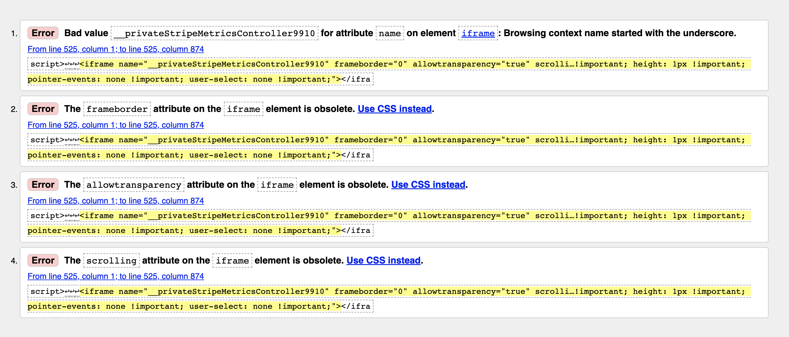

The developer was able to rectify this error by creating some custom JavaScript to edit the `name` attribute of the iframe, and remove the prepended underscore.
They also removed the `frameborder`, `allowtransparency` and `scrolling` attributes which were offending the W3C HTML Validator.

The code used is thus:

```
$(document).ready(function () {
        const stripeIFrame = $("iframe");
        let stripeIFrameNameAttr = stripeIFrame.attr("name");
        stripeIFrameNameAttr = stripeIFrameNameAttr.split("_")[2];
        stripeIFrame.attr("name", stripeIFrameNameAttr);
        stripeIFrame.removeAttr("frameborder");
        stripeIFrame.removeAttr("allowtransparency");
        stripeIFrame.removeAttr("scrolling");
    });
```

This effectively removed the offending attributes of the Stripe iframe, and allowed the Subscription page to pass W3C Validation with no errors.

#### Profile Page

##### Full Calendar Validation Errors

##### "Role" Attributes on td, tr, and tbody elements (rectified)

Similarly to the issues faced by a third-party package in the Subscription page, issues were faced when validating the automatically-generated HTML table, generating by the [FullCalendar](https://fullcalendar.io/) API.

Upon validating the HTML code for the Profile page, many errors were thrown due to the semantics used in _FullCalendar_'s automatically-generated calendar.

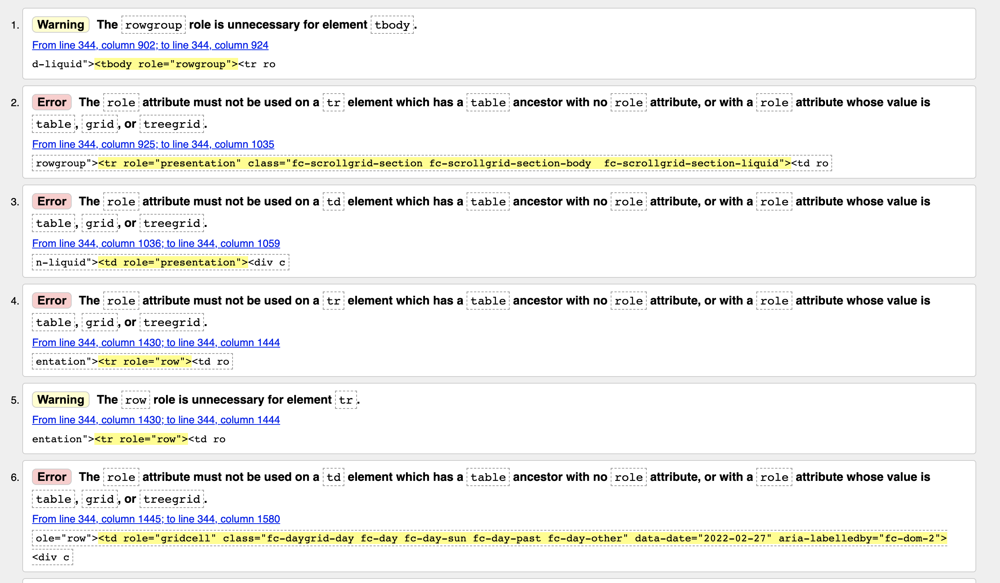

Errors and warnings of this nature are present for every `td` element used in their calendar. Again, the developer made great efforts to research and find a way to solve this issue so the calendar passed validation with a clean sheet.

Initially, the developer deducted that they could download the library and add it to their project without CDN, and edit the JavaScript file to remove the offending attributes of the table elements. However, the website offers no support for downloading the package. Users can only use _FullCalendar_ via CDN or as an NPM package.

The developer was able to rectify some, but not all of the errors. They created custom JavaScript code to remove the `role` attributes from all `td`, `tr` and `tbody` elements generated by _FullCalendar_:

```
    const tableDataCells = document.querySelectorAll("td");
    for (let cell of tableDataCells) {
      cell.removeAttribute("role");
    }

    const tableRows = document.querySelectorAll("tr");
    for (let row of tableRows) {
      row.removeAttribute("role");
    }

    const tableBody = document.querySelector("tbody");
    tableBody.removeAttribute("role");
  }
```

This effectively removed the offending attributes from the _FullCalendar_ table, and allowed these elements to pass the W3C HTML Validator with no errors.

##### FullCalendar Table Markup Errors

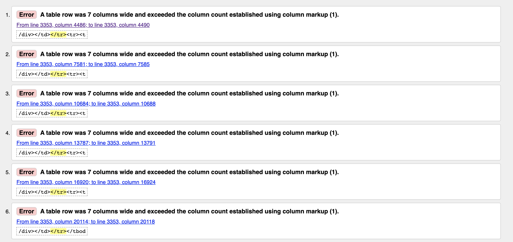

However, there is another error being thrown, which seems to reference the very structure of the table that _FullCalendar_ generates:

`A table row was 7 columns wide and exceeded the column count established using column markup (1).`

Since this error involves the structure of the table itself, it's beyond the scope of the developer's current skillset to find a way to create custom JS code which can alter the HTML structure of a table generated by a third-party package. If the developer had more time before submission, they would undergo further research and find a sure-fire way to edit FullCalendar's HTML Calendar structure, and rectify this error.

Though sadly at the present moment, as much as they'd like to pass the W3C Validator with a clean sheet, it's with a heavy heart that they had to admit defeat with regards to this particular error.

Short of researching and integrating a completely new calendar library, or removing the calendar feature from the website altogether, a useful solution could not be found in time before project submission.

#### Overview

The developer's HTML code was validated throughout the lifecycle of the project's development, and has passed all validator tests with no errors shown.

All errors and warnings that were thrown by the validator are a direct result of the third-party packages used by the website. The developer is aware that regardless of whether they wrote the code or not, using a third-party package that generates unsemantic code isn't a good practice.

Careful consideration will be made in the developer's future, when choosing third-party packages to use in their websites.

## CSS

The [W3C Jigsaw CSS Validator](https://validator.w3.org/) was used to validate the website's CSS files.

All CSS files passed validation tests with no issues.

At the time of deployment, there are 36 warnings:

1. Imported style sheets are not checked in direct input and file upload modes.

   - Accounts for 1 of the 36 warnings

2. <extension> is an unknown vendor extension
   - Accounts for 35 of 36 warnings

Since these warnings are a result of W3C Jigsaws inability to interpret them by default,
the developer is satisfied that the warnings can be dismissed.

## PEP8 Compliancy

All custom Python code was validated for PEP8 Compliancy using the [pep8online validator](http://pep8online.com/)

The following files have been checked for validation:

- Root

  - custom_storages.py
  - test_helpers.py
  -

- Bookings

  - admin.py
  - apps.py
  - classes.py
  - forms.py
  - functions.py
  - models.py
  - test_views.py
  - tests.py
  - urls.py
  - utils.py
  - views.py

- Home

  - admin.py
  - apps.py
  - models.py
  - tests.py
  - urls.py
  - views.py

- Jobs
  - admin.py
  - apps.py
  - forms.py
  - functions.py
  - models.py
  - test_models.py
  - tests.py
  - urls.py
  - views.py

Profiles
_ custom_tags.py
_ admin.py
_ apps.py
_ forms.py
_ functions.py
_ models.py
_ signals.py
_ test*models.py
* test*urls.py
* test*views.py
* urls.py
\_ views.py \* widgets.py

Social
_ admin.py
_ apps.py
_ forms.py
_ functions.py
_ models.py
_ signals.py
_ test_models.py
_ test*views.py
* urls.py
\_ views.py

Subscriptions
_ tests.py
_ urls.py
_ views.py
_ webhook_handler.py

At the time of deployment, there are no validation errors in any files listed.

## JS Validation

The project's JavaScript files are validated by [JSHint](https://jshint.com/)

The following files have been ran through the JSHint Validator:

- Root Static JS
  - ajax_error_message.js
  - delete_alert_modals.js
  - form_ajax.js
  - format_date.js
  - notification.js
  - toastify.js
- Bookings
  - booking_form.js
  - rating.js
- Home
  - index.js
- Jobs
  - filter.js
  - job_detail_modal.js
  - job_fee_icons.js
- Profiles
  - audio_dropzone.js
  - bar-ui.js
  - calendar_profile.js
  - calendar.js
  - dashboard_modals.js
  - display_star_rating.js
  - edit_review_modals.js
  - formset.js
  - progress_bar.js
  - soundmanager.js
  - switch_form_pages.js
- Subscriptions
  - checkout.js

## Unused/Undefined Variables

JSHint threw warnings related to the use of unused/undefined variables.

### Unused Variables

The following custom functions are the "unused variables" flagged by JSHint:

- `displayAJAXErrorMessage()`

  - Defined in it's own file and shared among JavaScript files which use AJAX to communicate with the backend.

- `formatDate()`

  - Defined in it's own file and shared in `dashboard_modals.js`

- `dateDiffInDays()`

  - Defined in it's own file and shared in `dashboard_modals.js`

- `displayToast()`
  - Defined in it's own file and shared among various JavaScript files which required toasts to be displayed (principally in AJAX success callbacks).

These functions are defined in a seperate file to keep the workspace clean, and are used across other files involved in the project. Though the functions aren't being used in the file they are defined in, it is indeed being used in other files of the project.

### Undefined Variables

The following custom functions and variables are the "undefined variables" flagged by JSHint:

- `displayToast()`

  - Defined in a seperate file.

- `displayAJAXErrorMessage()`

  - Defined in a seperate file.

- `mediaUrl`

  - Define in script tags in 'base.html'

- `formatDate()`

  - Defined in another file

- `dateDiffInDays`
  - Define in another file

The following variables and functions are provided by third-party CDNs:

- `Stripe`

- `Toastify`

- `FullCalendar`

- `Dropzone`

Since the custom variables and functions are defined in a seperate file to keep a clean workspace, JSHint of course will assume that they are not being used if it cannot find a reference to the variable/function in the same file.

Similarly with variables and functions provided via CDN link, JSHint won't be aware of their definition since it doesn't have access to the files provided via CDN.

With this, the developer is satisfied that these warnings can be dismissed.

# Testing User Stories from UX Section of README.md

## First-Time Visitors

### As a visitor using the website for the first time, I want...

1. **The purpose of the website to be evident upon the first visit, so I can quickly determine that the website will suit my needs.**

   - Upon landing on the website, the user is presented immediately with the brand's logo, along with a lead paragraph "The best musicians and singers for hire."
   - A Call-to-Action is immediately visible to the user, inviting them to 'Find a Dep'
     by visiting the 'Find a Dep' page to browse a list of musicians.
   - The home page features three itemised benefits that can be gained from using the website:
     - "Find a local musician to play your gig anywhere in the world, stress free."
     - "Perform and earn extra money"
     - "Make new connections and expand your network."

2. **To be able to navigate the website intuitively and with ease on all devices, so that my time isn't wasted.**

   - There is a persistent navbar across all pages of the website.
   - The navbar is fixed, so is present when users scroll down a page.
   - The navbar collapses down to a burger icon on mobile devices.

3. **To easily find information about how to use the platform, so I can understand the model of the service provided.**
   - An ordered list providing an overview of the website's usage is present in the website's home page.
   - The ordered list is accompany by images of the website's pages, to further reinforce website usage, and to provide a visual stimulus for the user.

### As a potential member, I want...

1. To easily find out what benefits I get from being a paying member, so I can determine whether the service is worth my money.

   - The website's 'Subscribe' page features two cards, each with a bulleted list featuring what a certain subscription-tier can offer them.
   - The 'Tier Two' subscription card features FontAwesome check icons to accompany the extra features a Tier Two subscription offers, so as to clearly indicate that a paid service can benefit a paid user.

2. To browse the website without having to register.

   - Each main page of the website is accessible to the user without them having to register.
   - Features such as the profile's music player are also interactive for non-registered users.

3. To be able to register to the website, so I can manage and display a profile.
   - A link to the registration page is presented at the top-level of the website's home-page.
   - A link to the registration page is also featured clearly in the website's navigation bar.
   - Upon registration, a link to "My Account" is featured in the navigation bar, where the user can find links to edit their profile.

## Tier One Members

### As a Tier One Member of the website, I want...

1. To be able to upload samples of my music to my profile, so I can showcase my skills and expertise.

   - The website's 'Edit My Profile' features a form for a user to add their audio files.
   - The form is presented as a Graphical User Interface, where users can drag and drop their audio files at their will.
   - Should a user wish to remove an audio file, they can do so easily and intuitively.

2. A link to my profile to be listed on a page, so potential clients/musicians will be able to find me easily.

   - The website features a link to 'Find a Dep' in the navigation bar, persistent across all pages.
   - All registered members of the website are displayed on a card in the 'Find a Dep' page.
   - The cards feature member details, average rating, and a link to the member's profile.

3. To be able to find other members using the service, so I am able to find a dep easily in the case that a can't make a gig.

   - The website features a link to 'Find a Dep' in the navigation bar, persistent across all pages.
   - All registered members of the website are displayed on a card in the 'Find a Dep' page.
   - The cards feature member details, average rating, and a link to the member's profile.
   - The page is filterable by instrument, genre, city and whether a member is available on the day of searching, to provide a more granular search for a suitable dep.
   - Search results can be sorted by rating.

4. To be notified when I get a job offer from another member, so I can respond quickly and professionally.

   - The website's navigation features a notification icon, with a badge indicated how many notifications a user has.
   - Upon clicking, the notification icon opens a dropdown menu, displaying the user's notifications.
   - Users receive notifications about all events related to an invitation/booking.
   - Users can click the notification to be taken to the relative card on their dashboard page, where they can make further actions about the given invitation/booking.

5. To be able to message a member with a response, or any questions, without leaving the website, to make the process run as smoothly as possible.

   - Each active invitation is presented on it's own card, in the user's dashboard page.
   - From these cards, the user can either choose to message the other member about the invitation, accept the invitation, or decline the invitation.
   - All messaging, accepting and declining events send a notification to the other user invovled in the active invitation.

6. To be able to message other members of the website, so I can grow my network.

   - Users are able to message other users in an active invitation/booking, available from the invitation cards displayed in the dashboard page.
   - The messaging service is in the form of a chat box, to provide familiarity and a pleasing user interface.
   - Notifications are sent to either user if they receive a message.

7. To display reviews/ratings from members for who I have provided services, so I can improve my reputation in the community.

   - All of a member's reviews/ratings are displayed clearly on their profile page, directly below a user's pitch.
   - The date of the review is present, along with an indication that a review has been edited (if applicable).
   - A user's average rating is displayed as star icons both in the top-level of their profile page, and on their card in the 'Find a Dep' page.

8. To access a dashboard displaying a record of ratings and reviews, so I can take account of how much I am benefitting from the service.

   - Upon landing on the dashboard page, the user is presented immediately with metric data and analytics related to their profile.
   - Their average rating is displayed on a card, with a short encouraging message if their rating is below 5 stars.

9. To be able to manage my subscription, so I can update my subscription tier when I like.

   - Upon visiting the website's 'Subscribe' page through the navigation bar, the user is presented with the cards. The card representing their current subscription-tier is highlighted.
   - The card displaying the tier that the user is not currently subscribed to features a button, which redirects the user to a Stripe customer portal, to manage their subscription.
   - The website's dashboard also features a navigation link which reads 'Manage My Subscription', so they can visit the Subscription page from multiple points of the website.

10. To be able to browse the Tier Two 'Find a Job' page without subscribing, so I can determine whether subscribing to a Tier Two service is worth the money.
    - Tier One members may browse the Tier Two page with no restrictions.
    - If a Tier One member likes the look of the page and would like to get involved by clicking on a button to 'Post a Job' or 'Send an Offer', they are presented with an alert that they need Tier Two access to use that service.
    - The alert modal window features a button inviting the user to subscribe to the Tier Two service, and reap the benefits of being a Tier Two member.

## Members in need of a dep

### As a member who is looking for a dep musician, I want...

1. A page where I can search for dep musicians, so I can easily begin to find a dep.

   - The website's 'Find a Dep' page features a comprehensive list of all members of the website.
   - Each card that belongs to a user features their name, profile image, instruments they play, rating, and an overview of their skills/personal details/pitch.

2. To be able to filter musicians by their expertise, instrument or style of music they play, and location, so I can find a dep which suits my needs.

   - The 'Find a Dep' page features a bootstrap accordion, displaying a form that can be used to filter deps.
   - Deps can be filtered by either location, genre, instrument or whether they are available on the day that the user is searching.
   - Search results can be sorted by rating, from low to high or high to low.

3. To be able to visit a dep's profile page, so I can find out more information about their experience and expertise.

   - Each card featured in the 'Find a Dep' page holds a button, inviting the user searching for a dep to visit the member's profile page.
   - Upon landing on a member's profile page, the user is presented clearly with the member's location, instruments they play and average rating, along with their profile picture (if provided).
   - Immediately below the header is the member's pitch, which a user can browse and determine if the member is a good fit for the user's needs.
   - A list of the member's genres of expertise is clearly detailed in a sidebar.
   - The sidebar collapses to a full-width column on mobile devices, to ensure responsivity across all devices.

4. To view a calendar of available/unavailable dates, so I can find out if a dep is available before pursuing further.

   - Each member's profile page features a calendar displaying their dates of unavailability.
   - The calendar is responsive across all device sizes.
   - Dates of unavailability are clearly marked in a light red colour, to give a clear visual indicator that the member is unavailable.
   - Unavailability calendars can be updated by a member from the 'Edit My Profile' page.

5. To hear samples of a dep's music, so I can be confident that they will provide a good service.

   - Each member's profile page features a music player, if the member has provided audio tracks.
   - The music player is interactive, and the user can scroll through tracks in the playlist, and turn volume up or down.
   - Music played via the music player persists while the user browses other aspects of the user's profile page.
   - The music player is responsive across all screen sizes.

6. To be able to message a potential dep from within the website, so that no unnecessary time is wasted.

   - Each member's profile page features a button to 'Contact <user>'.
   - Upon clicking this button, a line of communication can be opened by way of filling in an Invitation Form.
   - As well as event information, the Invitation Form provides a a textarea field for the user to give a detailed explanation as to what service they require.

7. To be notified when I have received a response from a dep I have messaged, so I can confirm the arrangement quickly and smoothly.

   - A notification icon is persistent across all pages of the website through the navigation bar.
   - The notifications icon is accompanied with a bootstrap badge, providing the user with a clear indication of how many notifications they have received.
   - A user is notified either when they have received a message about an invitation, or when an invitation has been accepted.
   - Clicking a received notification will take the user directly to the invitation in question.

8. To be able to send a confirmed dep a document with job details (with location, timings, number of sets etc), to allow for effective communication.
   - Upon acceptance of an invitation, the user is sent a notification, which upon clicking, will take them to a form to finalize their booking.
   - The booking for features fields for the user to provide the venue address, and textareas to inform the confirmed user about any travel or backline information.
   - Additionally, a dynamic form is presented, allowing the user to add up to 5 tracks, to provide any audio resources related to the booking.
   - Upon sending the booking form, an email and notification is sent to the confirmed member.
   - Upon clicking the notification, the confirmed member is taken directly to the page featuring the finalized booking details that the booker has sent.

## Tier Two Members

### As a Tier Two member of the website, I want...

1. All privileges provided by Tier One Membership.

   - This user story is satisfied by all solutions outlined in User Stories testing for Tier One Users.

2. To have access to a job listing, so I can find jobs that are in my local area.

   - The website features a 'Find a Job' page, where users can browse a list of available jobs.
   - The jobs are presented clearly on cards, with an image of the artist that requires a musician (if an image is provided), and a visual indicator of how lucrative the job is.

3. To be able to filter jobs by location or fee range, so I can more granularly search for a suitable job.

   - The 'Find a Job' page features a filter accordion bar.
   - The accordion bar displays a search text input, where a user can search for a job by city.
   - The accordion bar also features a select dropdown, where a user can search by fee range.
   - Fee amounts are presented graphically on the cards through dollar signs, indicating how lucrative a job is.

4. To be able to post a job that's in need of a dep, so I can be sure that my job gets the attention of Tier Two deps.

   - Tier Two members are able to post a job from the 'Find a Job' page.
   - This page clearly features a call-to-action in her page header.
   - The form to post a job advertisement opens in a modal window, so they are
     not redirected away from the 'Find a Job' page.
   - Members who post a job will see their job post immediately on the 'Find a Job' page.

5. To be able to edit or delete a job that I've posted, in case I have made a mistake, or that I've found someone to do the job from outside the website.

   - Members who have posted a job are able to edit their job from a seperate page.
   - The page is accessible via to points; either from the dashboard, or from the 'Find a Job' Page.
   - The job card on either of these pages features a link to either edit or delete a job.
   - If a member chooses to delete a job, a modal alert window is displayed, to confrim the deletion of the job.

6. To be notified when I received an offer for a job I've posted, so I can determine which member might be the right fit, with efficiency.

   - A notification object is created each time another Tier Two member registers interest in a job.
   - All notifications are presented in a dropdown in the website's navigation bar, so they are available across all pages of the website.
   - Clicking a notification will direct the job poster to the dashboard card, displaying the job post in question.

7. The members who have expressed interest in my job to be clearly visible, so I can inspect who might be a good fit, with ease.

   - Upon landing on the job post card, a list of all the members who have registered interest is displayed with their profile avatars.
   - Each avatar is clickable, which will take the job poster to the profile of the member who has registered interest.
   - The card also features a button to 'Choose A Member'. If the job poster would like to do a quick inspection from the dashboard, they may see a list of all the interest members, along with their profile images, and instruments they play.

8. To be listed at the top of searches when a potential client/musician is searching for a dep, so I can have a better chance of getting the work.
   - The User Profile model's queryset methods are designed to prioritise Tier Two members, regardless of rating.

# Automated Testing

Automated Unit Testing was employed during the development of the project. [Django's Test Suite](https://docs.djangoproject.com/en/4.0/topics/testing/) was used to perform unit tests of the views, models and urls of each app.

A total of 113 Unit tests were created and performed, in an effort to cover all individual views GET and POST methods, along with all urls, models and forms related to each application.

Unfortunately due to time constraints, it was not possible to cover all aspects of every application of the project individually.

However, the views of each app are all tested extensively, which helped to cover testing of many URL and model operations.

Below is an itemised list of the each app and the test files associated with them.

## Home

- [Test Views](home/test_views.py)
- [Test URLs](home/test_urls.py)

## Bookings

- [Test Views](bookings/test_views.py)
- [Test Forms](bookings/test_forms.py)

## Jobs

- [Test Models](jobs/test_models.py)
- [Test Views](jobs/test_views.py)

## Profiles

- [Test Models](profiles/test_models.py)
- [Test Views](profiles/test_views.py)
- [Test URLs](profiles/test_urls.py)

## Social

- [Test Models](social/test_models.py)
- [Test Views](social/test_views.py)

## Subscriptions

- [Test Views](subscriptions/test_views.py)

### Result

All 113 tests that were performed passed with no errors or failures.

## Test Coverage

To achieve maximum test coverage across the applications of the project, Python's [Coverage](https://coverage.readthedocs.io/en/6.3.2/)
library was used.

The coverage report returned **93%** coverage across the application. Below is a screen shot of the latest coverage report.

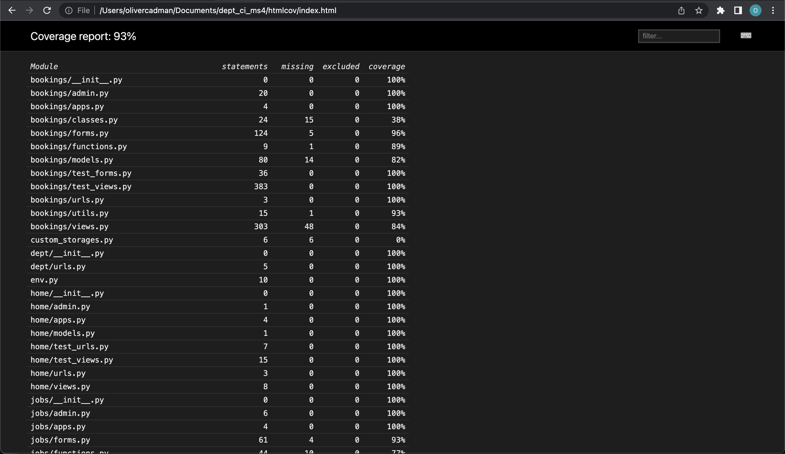

### Issues Testing Exceptions/Webhooks

Efforts were made to test the project's exception handlers, as well as the Stripe webhooks.

Upon research, it was found that using Python's [unittest.mock](https://docs.python.org/3/library/unittest.mock.html) library could be employed. By using the unittest.mock `@patch` decorator, one may add a `side_effect` to mock an Exception in a view.

Similarly, mock patch can mock a call to a third-party API such as Stripe, in order to test their webhooks and customer management.

However, after attempting to implement these tests in a number of permutations, the developer wasn't able to return accurate results.

To account for this, extensive manual testing was employed, particularly in order to test Stripe functionality when using it's checkout and customer portal.

# Lighthouse Testing

Google Chrome’s ‘Lighthouse’ extension for its DevTools feature was used to test the website’s Performance, Accessibility, Best Practices and Search Engine Optimisation. Listed below are the latest reports from Lighthouse’s run of testing:

## Tested Pages

### Home Page

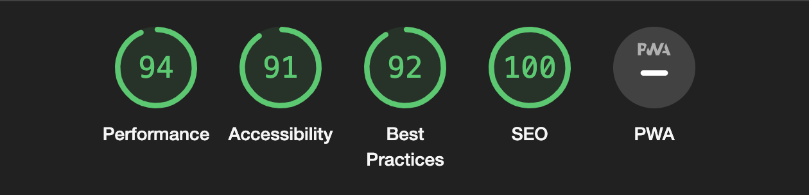

### Register Page

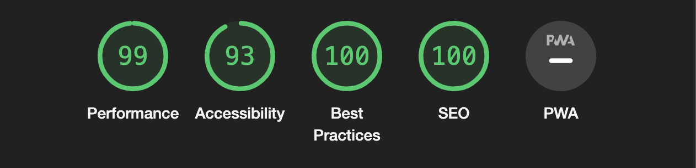

### Login Page

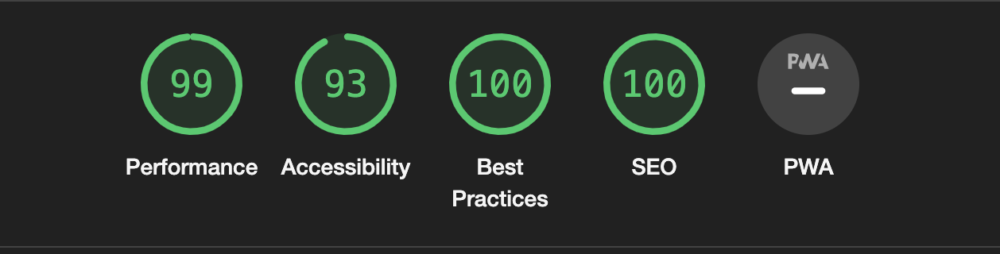

### Subscription Page

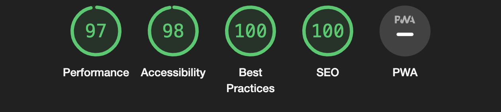

### Find a Dep Page


### Find a Job Page

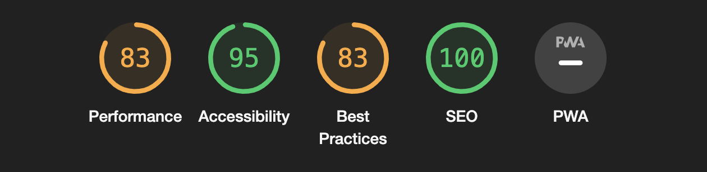

### Profile Page

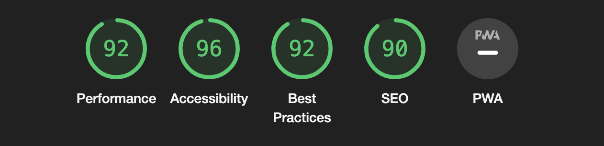

### Edit Profile Page

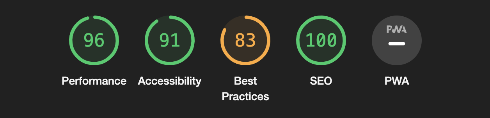

### Dashboard Page

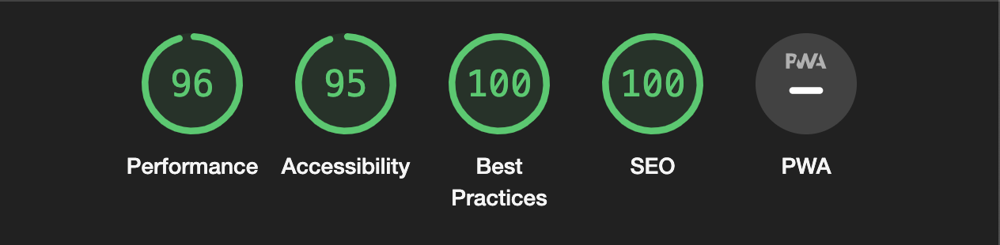

### Booking Form Page

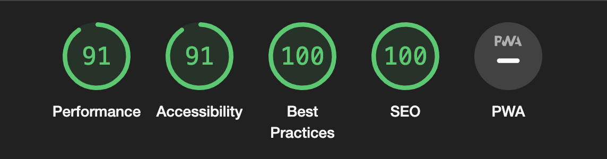

### Booking Success/Detail Page

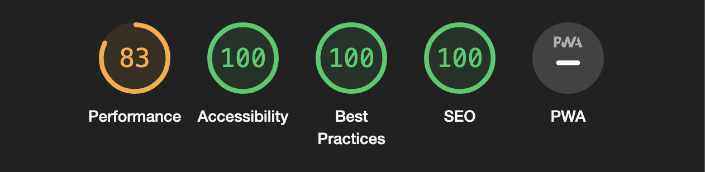

## Performance/Best Practice Issues - Attempts To Rectify

The principal warning that was thrown by Google Lighthouse was generally related to the performance of pages, specifically the 'Largest Contentful Paint'.

The warnings that lighthouse flagged read `serve images in next-gen formats`.

When the developer first encountered this issue, they understood that they couldn't particularly control what kind of image format a user may upload, when choosing a profile image, or an image to display in a job post.

With this in mind, the developer attempted to implement some backend functionality which converted any saved profile-image objects to a webp format.

The code that was written was thus, (referenced from https://www.webucator.com/tutorial/using-python-to-convert-images-to-webp/):

```
def convert_to_webp(source):
    """Convert image to WebP.

    Args:
        source (pathlib.Path): Path to source image

    Returns:
        pathlib.Path: path to new image
    """
    destination = source.with_suffix(".webp")

    image = Image.open(source)  # Open image
    image.save(destination, format="webp")  # Convert image to webp

    return destination
```

This solution was effective, but only when rendering on the client-side, when the images are being served. While this is a solution, it would certainly impact heavily on performance if there were hundreds of members featured on a page. Should many profile images need to be converted, performance would certainly suffer.

With this, the developer attempted to implement the same code but in the Edit Profile Form's `cleaned_data` method. However, the attempts were not fruitful, as the way the code was currently implemented required the image file to be saved to the database before any conversion was made, therefore skipping any conversion before saving to the database.

It is the developer's intention to encounter a useful solution to this issue, and the lighthouse performance error will surely be improved upon the next release.

# Significant Known Bugs

## Immutable QueryDict when accessing invitation messages

**Status**: Fixed

The project's Dashboard features a chat message window which allows users to send messages to one another about a particular invitation.

In order to get previously sent messages, an AJAX GET Handler was implemented, to return a queryset of existing messages for a current invitation as a `JSONResponse`, to be displayed in the chat window.

Consideirng that Django objects aren't `JSON Serializable`, the `Message` object needed to be prepared before being passed into the `JSONResponse`. The developer initially attempted this used Django's `model_to_dict()` function. However it became apparent that this method wasn't preserving the object's values, and was removing a non-editable field `date_of_message`.

Research was made into an alternative method, and the developer happened upon an [article post on StackOverflow](https://stackoverflow.com/questions/21925671/convert-django-model-object-to-dict-with-all-of-the-fields-intact), which provided an answer to the problem.

The code used is thus (featured in [bookings/functions.py](bookings/functions.py)):

```
from itertools import chain


def to_dict(instance):
    """
    Alternative to python's 'model_to_dict' function, which
    was excluding the non-editable 'date_of_message' field.

    https://stackoverflow.com/questions/21925671/
    convert-django-model-object-to-dict-with-all-of-the-fields-intact
    """

    opts = instance._meta
    data = {}
    for f in chain(opts.concrete_fields, opts.private_fields):
        data[f.name] = f.value_from_object(instance)
    for f in opts.many_to_many:
        data[f.name] = [i.id for i in f.value_from_object(instance)]
    return data
```

This method of converting the object to a dictionary provided a solution, and all fields of the Message object were
then passed into the `JSONResponse` correctly.

## Filtering Dep List and Job List - All Query Parameters sent at once

**Status**: Fixed

The _Dep List_ and _Job List_ pages of the project feature filter and search functionality.

The initial goal of this functionality as to allow users to filter the query one criteria at a time, so the URL could be built as such:

- First Search

  - `/jobs/find_a_dep?instrument=Guitar`

- Second Search with another criteria added

  - `jobs/find_a_dep?instrument=Guitar&location=Manchester`

- Third Search with another criteria added
  - `jobs/find_a_dep?instrument=Guitar&location=Manchester&genre=Pop`

However, the initial implementation of this functionality resulted in all query parameters being included in the GET request. This resulted in the URL GET request looking something akin to this:

`/jobs/find_a_dep?instrument=Guitar&location=&genre=&available_today=`

Of course, this query would not return any results.

After some consideration and experimenting, a solution was found, involving some JavaScript code to disable the form elements immediately before submitting the form. The code flow is outline below:

- User clicks submit button.
- Define the form field's initial values in JavaScript.
- JavaScript code looks through the form field's values.
- If any initial default values are found to match the values defined, those form elements are disabled, and not added to the 'GET' request.
- Submit the form

This code elegantly solved the issue, and search criteria could then be added to the 'GET' request individually.

## Boto3 Audio Download - Signature Version

**Status**: Fixed

The project includes a feature for users to download audio files from a _Booking Detail_ page, which are added by the member who has sent them a booking.

In development, these files downloaded without issue, but upon deployment, it was discovered that a production backend needed to be configured in order to serve files as downloads from the Amazon S3 Bucket.

The developer [created a class](bookings/classes.py) to handle this functionality. However, upon manual testing, a 403 error was being thrown:

`The authorization mechanism you have provided is not supported. Please use AWS4-HMAC-SHA256.`

Upon research, it was found that the Signature Version which `boto3` originally used was outdated.

To remedy this, `boto3` needed to have it's Signature Version updated in order to be authenticated correctly:

```
from botocore.client import Config

def create_boto3_session(self):
        """
        Instantiate a boto3 client
        """
        client = boto3.client(
            "s3",
            config=Config(signature_version="s3v4"),
            region_name=self.region,
            aws_access_key_id=self.access_key,
            aws_secret_access_key=self.secret_key
        )

        return client

```

In the instance method of the class the developer created, the `boto3` object needed it's `config` variable updating, which was possible using `botocore.client`'s class `Config`.

Once this signature version was added, the tests passed, and audio files could be downloaded.
